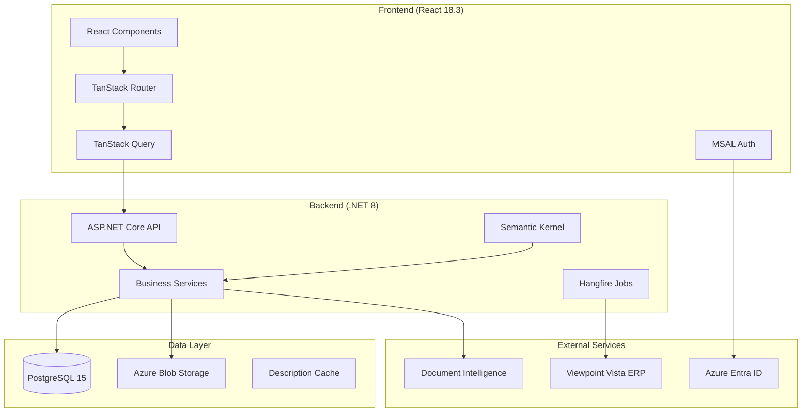
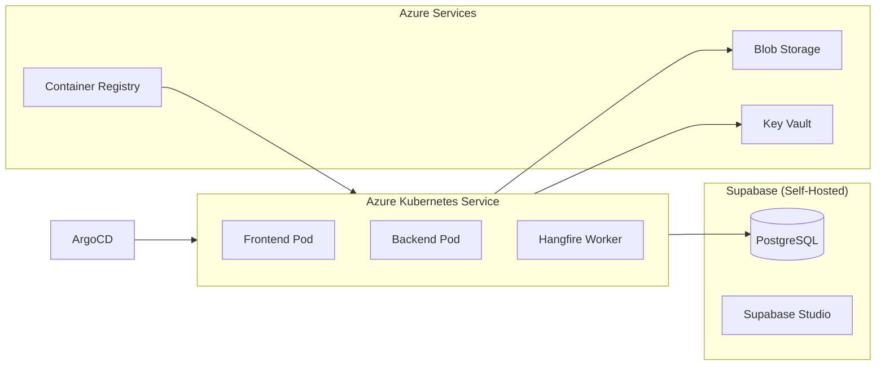

# ExpenseTrack Architecture Overview

**Last Updated**: 2026-01-25
**Token Estimate**: ~800 tokens

---

## System Architecture



## Layer Architecture

| Layer | Technology | Purpose |
|-------|------------|---------|
| **Presentation** | React + TypeScript | User interface, routing, state |
| **API** | ASP.NET Core 8 | REST endpoints, auth, validation |
| **Business** | C# Services | Domain logic, AI orchestration |
| **Infrastructure** | EF Core + Azure | Data access, blob storage, jobs |
| **Data** | PostgreSQL + pgvector | Persistence, embeddings, search |

## Deployment Topology



## Key Integration Points

| Integration | Protocol | Purpose |
|-------------|----------|---------|
| Azure Entra ID | OAuth 2.0 / OIDC | User authentication |
| Document Intelligence | REST API | OCR receipt extraction |
| Viewpoint Vista | SQL (read-only) | Dept/Project/GL sync |
| Azure Blob Storage | REST + SAS tokens | Receipt file storage |

## AI/ML Pipeline (Tiered)

1. **Tier 1 (Rule-based)**: Pattern matching, vendor aliases, keyword extraction
2. **Tier 2 (Semantic)**: Semantic Kernel + Azure OpenAI for categorization
3. **Vector Search**: pgvector for expense similarity matching

## GitOps Deployment Flow

```
PR Merge → ci-full.yml → cd-deploy.yml → ACR Push → ArgoCD Sync → AKS
```
