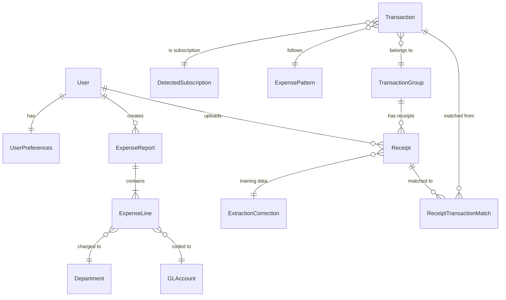
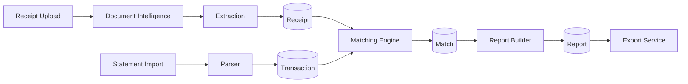

# ExpenseTrack Data Models

**Last Updated**: 2026-01-25
**Token Estimate**: ~1000 tokens

---

## Entity Relationship Diagram



## Core Entities

### Receipt
```typescript
interface Receipt {
  id: string                    // UUID
  userId: string
  fileName: string
  blobUrl: string               // Azure Blob SAS URL
  thumbnailUrl?: string
  contentType: string           // image/*, application/pdf
  status: ReceiptStatus         // Pending, Processed, Failed
  extractedVendor?: string
  extractedAmount?: number
  extractedDate?: Date
  extractedItems?: LineItem[]
  confidence: number            // 0-100 extraction confidence
  createdAt: Date
  updatedAt: Date
}
```

### Transaction
```typescript
interface Transaction {
  id: string
  userId: string
  sourceStatementId?: string
  transactionDate: Date
  postDate?: Date
  vendorName: string
  normalizedVendor?: string     // Via VendorAlias
  amount: number
  category?: string
  categoryConfidence?: number
  isReimbursable: boolean
  status: TransactionStatus
  matchedReceiptId?: string
  groupId?: string              // TransactionGroup
}
```

### ReceiptTransactionMatch
```typescript
interface Match {
  id: string
  receiptId: string
  transactionId: string
  matchScore: number            // 0-100
  matchMethod: 'auto' | 'manual'
  amountScore: number
  dateScore: number
  vendorScore: number
  confirmedAt?: Date
  confirmedBy?: string
}
```

### ExpenseReport
```typescript
interface ExpenseReport {
  id: string
  userId: string
  period: string                // "2026-01"
  status: 'draft' | 'submitted' | 'approved'
  totalAmount: number
  lineCount: number
  createdAt: Date
  updatedAt: Date
  submittedAt?: Date
}
```

### ExpenseLine
```typescript
interface ExpenseLine {
  id: string
  reportId: string
  transactionId?: string
  receiptId?: string
  expenseDate: Date
  vendorName: string
  description: string
  glCode: string
  departmentCode: string
  projectCode?: string
  amount: number
  isSplit: boolean
  parentLineId?: string         // For split lines
}
```

## Reference Data (Vista Sync)

### Department
```typescript
interface Department {
  id: string
  code: string                  // PRDepartment from Vista
  name: string                  // First 25 chars
  isActive: boolean
  lastSyncedAt: Date
}
```

### GLAccount
```typescript
interface GLAccount {
  id: string
  code: string                  // GLAcct from Vista
  description: string
  category: string
  isActive: boolean
}
```

### Project
```typescript
interface Project {
  id: string
  code: string                  // Job from Vista JCCM
  name: string
  status: 'active' | 'closed'
  isActive: boolean
}
```

## Analytics & ML Entities

### ExpensePattern
```typescript
interface ExpensePattern {
  id: string
  userId: string
  vendorPattern: string         // Regex or normalized name
  typicalAmount: number
  frequency: 'daily' | 'weekly' | 'monthly' | 'yearly'
  suggestedGlCode?: string
  suggestedDepartment?: string
  confidence: number
}
```

### ExpenseEmbedding
```typescript
interface ExpenseEmbedding {
  id: string
  transactionId: string
  embedding: number[]           // pgvector (1536 dimensions)
  modelVersion: string
  createdAt: Date
}
```

### ExtractionCorrection
```typescript
interface ExtractionCorrection {
  id: string
  receiptId: string
  field: 'vendor' | 'amount' | 'date' | 'items'
  originalValue: string
  correctedValue: string
  correctedBy: string
  correctedAt: Date
  usedForTraining: boolean
}
```

## API DTOs

### Receipt Upload Request
```typescript
interface UploadReceiptRequest {
  file: File
  transactionId?: string        // Pre-link to transaction
}
```

### Match Request
```typescript
interface CreateMatchRequest {
  receiptId: string
  transactionId: string
  overrideScore?: number        // Manual match
}
```

### Report Export Request
```typescript
interface ExportReportRequest {
  period: string
  format: 'pdf' | 'excel' | 'csv'
  includeReceipts: boolean
  groupBy?: 'vendor' | 'category' | 'department'
}
```

### Analytics Query
```typescript
interface AnalyticsQuery {
  startDate: Date
  endDate: Date
  groupBy: 'day' | 'week' | 'month'
  metrics: ('total' | 'count' | 'average')[]
  filters?: {
    departments?: string[]
    vendors?: string[]
    categories?: string[]
  }
}
```

## Database Indexes

| Table | Index | Purpose |
|-------|-------|---------|
| receipts | `userId, createdAt DESC` | User's recent receipts |
| transactions | `userId, transactionDate` | User's transactions |
| transactions | `normalizedVendor` | Vendor matching |
| expense_embeddings | `embedding vector_cosine_ops` | Similarity search |
| matches | `receiptId, transactionId` | Match lookup |
| expense_lines | `reportId` | Report lines |

## Data Flow


