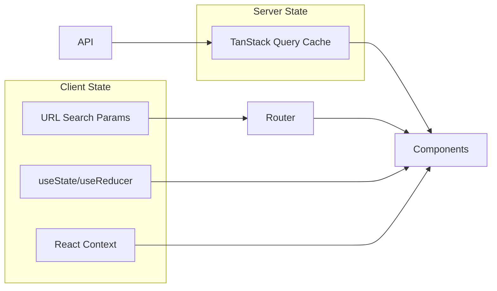
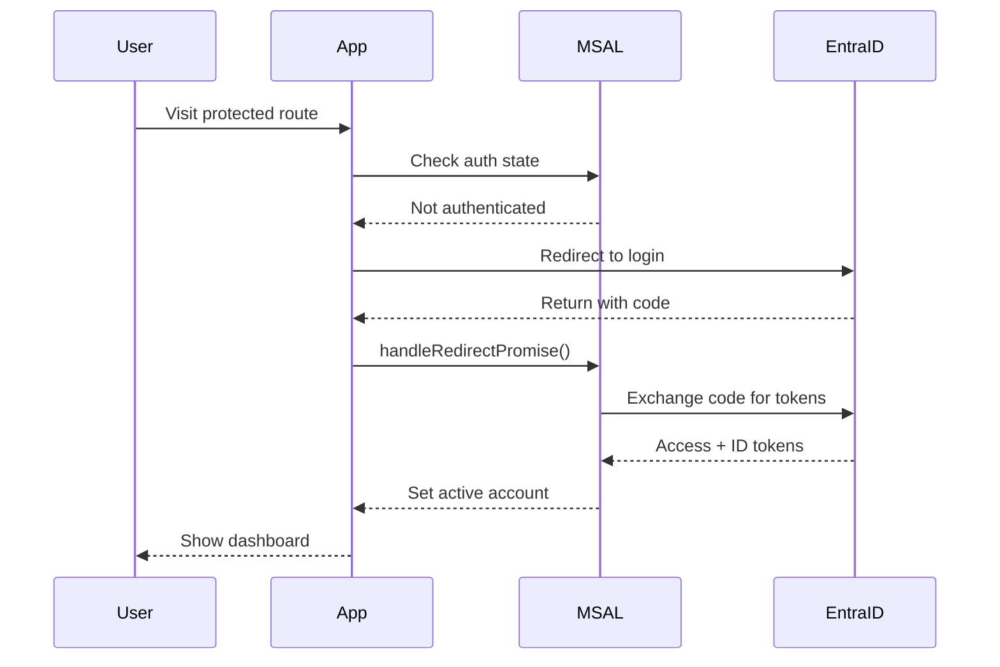

# ExpenseTrack Frontend Architecture

**Last Updated**: 2026-01-25
**Token Estimate**: ~1100 tokens

---

## Project Structure

```
frontend/src/
├── routes/                    # TanStack Router (file-based)
│   ├── __root.tsx            # Root layout
│   ├── _authenticated.tsx    # Auth guard layout
│   ├── _authenticated/       # Protected routes
│   │   ├── dashboard/
│   │   ├── receipts/
│   │   ├── transactions/
│   │   ├── matching/
│   │   ├── reports/
│   │   ├── analytics/
│   │   └── ...
│   ├── login.tsx
│   └── index.tsx
├── components/               # React components by feature
│   ├── ui/                   # shadcn/ui primitives (29+)
│   ├── layout/               # AppShell, Header, Nav
│   ├── design-system/        # Reusable patterns
│   ├── receipts/             # Receipt components (8)
│   ├── transactions/         # Transaction components (12)
│   ├── matching/             # Matching UI (9)
│   ├── reports/              # Report components (10)
│   ├── analytics/            # Analytics/charts (8)
│   ├── dashboard/            # Dashboard widgets (8)
│   ├── patterns/             # Pattern analysis (8)
│   ├── predictions/          # Predictions UI (6)
│   └── missing-receipts/     # Missing receipts (8)
├── hooks/                    # Custom React hooks
│   ├── queries/              # TanStack Query hooks (16)
│   └── *.ts                  # UI hooks (6)
├── providers/                # Context providers
├── services/                 # API client, utilities
├── auth/                     # MSAL configuration
├── lib/                      # Helpers, utilities
└── types/                    # TypeScript definitions
```

## Route Structure

```mermaid
graph TD
    Root[__root.tsx] --> Auth[_authenticated.tsx]
    Root --> Login[/login]
    Root --> Index[/ - OAuth callback]

    Auth --> Dashboard[/dashboard]
    Auth --> Receipts[/receipts]
    Auth --> Transactions[/transactions]
    Auth --> Matching[/matching]
    Auth --> Reports[/reports/*]
    Auth --> Analytics[/analytics]
    Auth --> Predictions[/predictions]
    Auth --> Missing[/missing-receipts]
    Auth --> Settings[/settings]
    Auth --> Admin[/admin/*]
```

## Query Hooks (TanStack Query)

| Hook | Queries | Mutations | Purpose |
|------|---------|-----------|---------|
| `use-receipts` | 3 | 4 | Receipt CRUD, upload |
| `use-transactions` | 4 | 2 | Transaction queries |
| `use-matching` | 2 | 3 | Match operations |
| `use-reports` | 5 | 3 | Report generation |
| `use-analytics` | 4 | 0 | Analytics data |
| `use-dashboard` | 3 | 0 | Dashboard widgets |
| `use-predictions` | 2 | 1 | Expense predictions |
| `use-reference-data` | 3 | 0 | GL/Dept/Project |
| `use-report-export` | 1 | 1 | Export functionality |
| `use-report-jobs` | 2 | 0 | Job status polling |
| `use-extraction-corrections` | 2 | 2 | Training data |
| `use-settings` | 1 | 1 | User preferences |
| `use-transaction-groups` | 3 | 1 | Grouping |
| `use-missing-receipts` | 2 | 0 | Missing detection |

## UI Hooks

| Hook | Purpose |
|------|---------|
| `use-mobile` | Responsive breakpoint detection |
| `use-keyboard-shortcuts` | Keyboard shortcut registration |
| `use-polling` | Interval-based data refresh |
| `use-undo` | Undo/redo state management |
| `use-filter-presets` | Saved filter configurations |
| `use-report-editor` | Report editor state machine |

## Component Patterns

### Feature Component Structure
```
components/receipts/
├── receipt-card.tsx          # Individual receipt display
├── receipt-list.tsx          # List container
├── receipt-upload.tsx        # Upload dropzone
├── receipt-preview.tsx       # Full preview modal
├── receipt-filters.tsx       # Filter controls
├── receipt-thumbnail.tsx     # Thumbnail display
├── receipt-details.tsx       # Detail panel
└── receipt-actions.tsx       # Action buttons
```

### UI Component Library (shadcn/ui)
```
components/ui/
├── button.tsx, card.tsx, dialog.tsx
├── table.tsx, tabs.tsx, toast.tsx
├── select.tsx, input.tsx, form.tsx
├── dropdown-menu.tsx, popover.tsx
├── skeleton.tsx, spinner.tsx
└── ... (29+ components)
```

## State Management



## Authentication Flow



## Key Dependencies

| Package | Version | Purpose |
|---------|---------|---------|
| React | 18.3 | UI framework |
| TanStack Router | 1.141 | File-based routing |
| TanStack Query | 5.90 | Server state |
| Tailwind CSS | 4.x | Styling |
| shadcn/ui | latest | UI components |
| MSAL Browser | 4.27 | Azure AD auth |
| Framer Motion | 11.x | Animations |
| Recharts | 2.x | Charts |
| Zod | 3.x | Validation |
