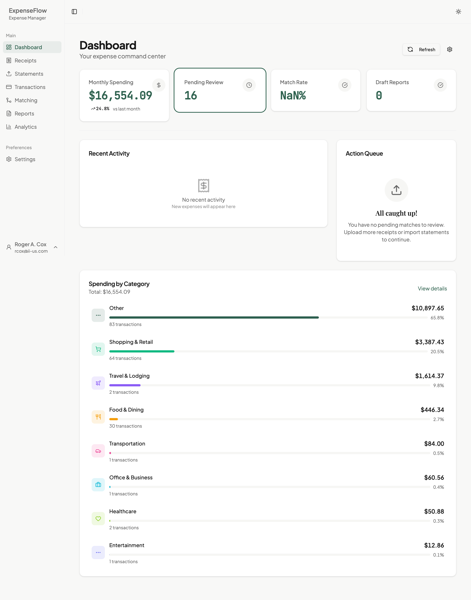
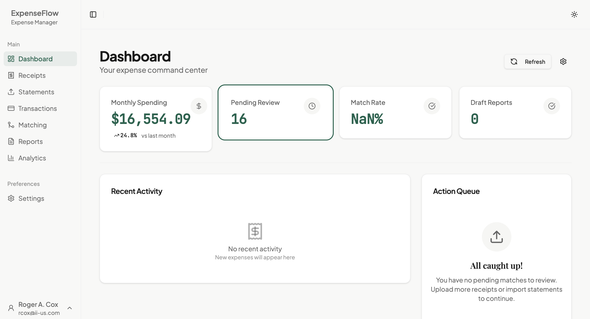

# Dashboard Overview

Understand your ExpenseFlow dashboard and how to use it effectively.

## Overview

The dashboard is your command center for expense management. It shows pending tasks, recent activity, and key metrics at a glance. Everything you need to manage your expenses starts here.

*Caption: The ExpenseFlow dashboard showing all main components*

## Dashboard Components

### Navigation Bar

The top navigation bar provides access to all ExpenseFlow areas:

| Icon/Link | Destination |
|-----------|-------------|
| **Dashboard** | Return to this home screen |
| **Receipts** | View and upload receipts |
| **Transactions** | View imported bank transactions |
| **Matching** | Review receipt-transaction match proposals |
| **Reports** | Create and manage expense reports |
| **Analytics** | Spending trends and insights |
| **Settings** | Personalization and preferences |
| **Profile** | Sign out and account info |

### Action Queue

*Caption: The action queue showing prioritized pending tasks*

The [Action Queue](../04-reference/glossary.md#action-queue) shows tasks that need your attention, sorted by priority:

**Priority Levels**:
- **High** (red indicator): Requires immediate action
  - Failed uploads needing retry
  - Extraction errors requiring correction
  - Reports awaiting your review
- **Medium** (amber indicator): Should be addressed soon
  - Match proposals awaiting review
  - Categorization suggestions
- **Low** (green indicator): Can wait
  - Optional categorizations
  - Suggested improvements

**Action Types**:
| Icon | Type | Description |
|------|------|-------------|
| Receipt | Review extraction | AI-extracted fields need verification |
| Link | Review match | A match proposal awaits approval |
| Category | Categorize | Transaction needs GL code assignment |
| Document | Review report | Expense report needs attention |

Click any action item to navigate directly to that task.

**Queue Priority Logic**:

The queue intelligently orders tasks based on:

1. **Age**: Older items bubble up over time
2. **Impact**: High-value expenses get priority
3. **Urgency**: Time-sensitive items (approaching report deadlines)
4. **Dependencies**: Items blocking other workflows

**Batch Processing**:

For efficiency, you can process multiple queue items:

1. Click **Process All** to review items in sequence
2. Use keyboard shortcuts for rapid processing (see [Keyboard Shortcuts](../04-reference/keyboard-shortcuts.md))
3. Items clear as you complete them

### Activity Feed (Expense Stream)

*Caption: The activity feed showing recent expense events*

The [Activity Feed](../04-reference/glossary.md#activity-feed) displays a chronological list of recent events:

**Event Types**:
| Icon | Color | Event |
|------|-------|-------|
| Receipt (blue) | Blue | Receipt uploaded |
| Arrows (purple) | Purple | Transaction imported |
| Check (green) | Green | Match confirmed |
| Tag (amber) | Amber | Expense categorized |
| Document (gray) | Gray | Report created/updated |

Each event shows:
- **Title**: What happened
- **Amount**: Dollar value (if applicable)
- **Time**: How long ago (e.g., "2 hours ago")
- **Confidence**: AI confidence badge (if applicable)
- **Status**: Current state indicator

The feed updates automatically every 30 seconds. Pull down to refresh manually.

**Filtering the Feed**:

Narrow down what you see:

1. Click the filter icon above the feed
2. Select event types to show/hide
3. Set date range (Today, This Week, All)

**Event Details**:

Click any event to see:

- Full details about the expense
- Related items (receipts, transactions, matches)
- Actions you can take

### Metrics Row

*Caption: Key metrics at a glance*

The metrics row displays key numbers:

| Metric | What It Shows |
|--------|---------------|
| **Pending Actions** | Total items in your action queue |
| **Unmatched Receipts** | Receipts without transaction links |
| **Unmatched Transactions** | Transactions without receipt links |
| **This Month** | Total spending for current month |
| **vs Last Month** | Percentage change from previous month |

> **Tip**: Click any metric to navigate to the relevant page with appropriate filters applied.

**Interpreting the Metrics**:

| Metric State | What It Means |
|--------------|---------------|
| **Pending Actions = 0** | Great! You're caught up |
| **Unmatched high** | Import recent statements or upload receipts |
| **This Month increasing** | More spending than usual - review if expected |
| **vs Last Month red** | Significant increase - check for anomalies |
| **vs Last Month green** | Spending down from last month |

**Metric Alerts**:

Metrics turn **amber** when approaching concerning levels and **red** when action is recommended. This helps you quickly spot when your expense workflow needs attention.

## Quick Actions

From the dashboard, you can quickly:

1. **Upload a Receipt**: Click the upload button or drag a file onto the dashboard
2. **Review Matches**: Click any match proposal in the action queue
3. **View Reports**: Navigate to see report status
4. **Check Analytics**: See spending trends and patterns

## Understanding Status Indicators

Throughout the dashboard, you'll see color-coded indicators:

| Color | Meaning |
|-------|---------|
| **Green** | Good/Complete/High confidence (90%+) |
| **Amber/Yellow** | Warning/Needs review/Medium confidence (70-89%) |
| **Red** | Error/Urgent/Low confidence (<70%) |
| **Blue** | Information/In progress |
| **Gray** | Neutral/Inactive |

## Customizing Your View

The dashboard layout is optimized for typical workflows. To customize:

- **Theme**: Change between light and dark mode in [Settings](../04-reference/settings.md)
- **Default View**: Set preferences for how data displays
- **Notifications**: Configure which events appear prominently

## Troubleshooting

### Dashboard Shows No Data

If your dashboard appears empty:

1. You may be new with no expenses yet
2. Import a statement or upload a receipt to get started
3. Check your date filters (if applicable)

### Action Queue Items Not Clearing

If completed items remain in the queue:

1. Refresh the page (F5 or Cmd+R)
2. The queue updates after actions are fully processed
3. Some items require additional steps to complete

## What's Next

Now that you understand the dashboard:

- [Quick Start](./quick-start.md) - Upload your first receipt
- [Uploading Receipts](../02-daily-use/receipts/uploading.md) - All upload methods explained
- [Matching](../02-daily-use/matching/review-modes.md) - Learn to review match proposals
