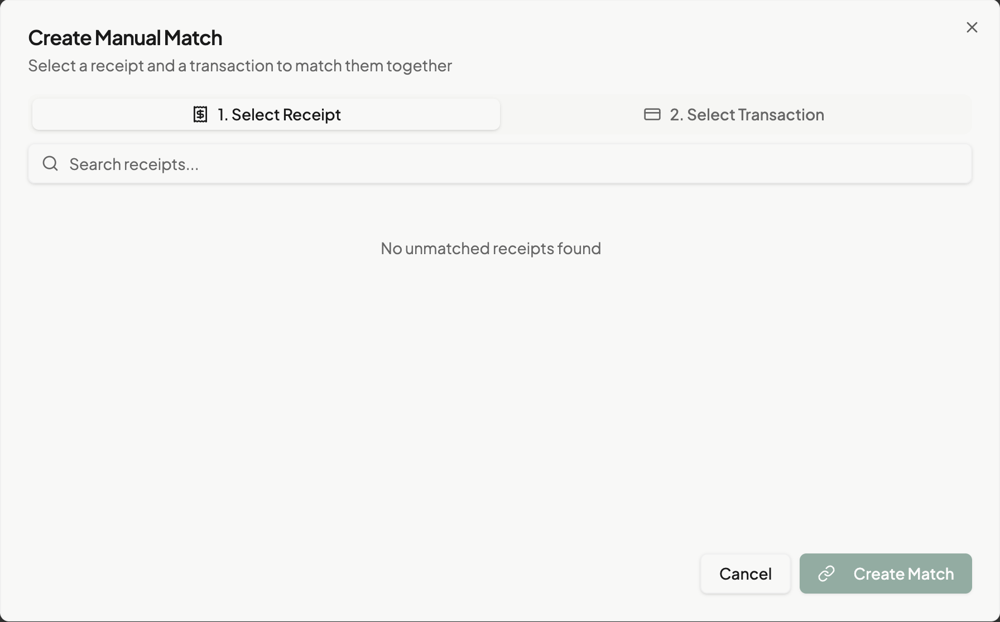

# Manual Matching

Create matches between receipts and transactions yourself.

## Overview

When the AI doesn't propose a match, or proposes the wrong one, you can manually link a receipt to a transaction. [Manual Matching](../../04-reference/glossary.md#manual-matching) gives you full control over the matching process.

## When to Use Manual Matching

### Common Scenarios

- **No proposal**: The AI didn't find a likely match
- **Wrong proposal**: You rejected an incorrect match
- **Multiple possibilities**: You know which transaction is correct
- **Date mismatch**: Transaction posted much later than receipt date
- **Amount difference**: Split transaction or additional fees

## Starting Manual Match

### From a Receipt

1. Navigate to **Receipts**
2. Find the unmatched receipt
3. Click the receipt to open details
4. Click **Match Manually** or the link icon

### From a Transaction

1. Navigate to **Transactions**
2. Find the unmatched transaction
3. Click the transaction to open details
4. Click **Match Manually** or the link icon

### From the Matching Page

1. Go to **Matching**
2. Click **Manual Match** button
3. Or press **M** in Review Mode

## The Manual Match Dialog

*Caption: The manual match dialog with search and selection*

The dialog shows two sections:

### Left Side: Receipts

- List of unmatched receipts
- Search by vendor or date
- Filter by date range
- Click to select

### Right Side: Transactions

- List of unmatched transactions
- Search by description or amount
- Filter by date range
- Click to select

## Creating a Manual Match

### Step 1: Select Receipt

1. Browse or search the receipt list
2. Look at thumbnails and dates
3. Click to select the receipt
4. Selection shows a highlight

### Step 2: Select Transaction

1. Browse or search the transaction list
2. Compare amounts and dates
3. Click to select the transaction
4. Selection shows a highlight

### Step 3: Confirm Match

1. Review your selections at the bottom
2. Verify the amounts match (or are close)
3. Verify the dates make sense
4. Click **Create Match**

The match is created immediately.

## Search Tips

### Finding Receipts

- Search by vendor name: "Starbucks"
- Search by date: "Dec 15" or "12/15"
- Sort by date to find recent uploads

### Finding Transactions

- Search by amount: "47.82"
- Search by description: "coffee"
- Filter to specific date range

## Matching Different Amounts

Sometimes amounts don't match exactly:

| Difference | Cause | Solution |
|------------|-------|----------|
| Small (< $5) | Tip added | Match anyway, note if needed |
| Tax difference | Tax not on receipt | Match anyway |
| Large difference | Different purchase | Don't match, find correct pair |

> **Tip**: If amounts differ, add a note explaining why (e.g., "Includes $5 tip").

## Matching Across Date Ranges

Transaction dates may differ from receipt dates:

| Scenario | Receipt Date | Transaction Date | Action |
|----------|--------------|------------------|--------|
| Normal | Dec 15 | Dec 15 | Match normally |
| Weekend | Dec 15 (Fri) | Dec 17 (Mon) | Match - weekend delay |
| Credit card | Dec 15 | Dec 20 | Match - posting delay |
| Wrong month | Dec 15 | Jan 2 | Verify carefully |

## After Creating a Match

Once matched:

1. The match appears on the **Matching** page as "Confirmed"
2. Both receipt and transaction show "Matched" status
3. The pair is ready for expense reports
4. Your choice helps train the AI for future matches

## Unmatching (If Needed)

If you matched incorrectly:

1. Find the matched receipt or transaction
2. Click to open details
3. Click **Unmatch** or the unlink icon
4. Both items return to unmatched status
5. Create a new match if needed

## Common Issues

### Can't Find the Receipt

- Check that it's uploaded and processed
- Verify it's not already matched
- Expand the date range filter
- Search by vendor name

### Can't Find the Transaction

- Check that statement was imported
- Verify it's not already matched
- Check the date range (may have posted later)
- Search by amount

### Match Button Disabled

- Make sure you selected both a receipt AND a transaction
- Verify neither item is already matched

## What's Next

After manual matching:

- [Improving Accuracy](./improving-accuracy.md) - Help the AI learn
- [Confidence Scores](./confidence-scores.md) - Understand proposals
- [Review Modes](./review-modes.md) - Process other matches
