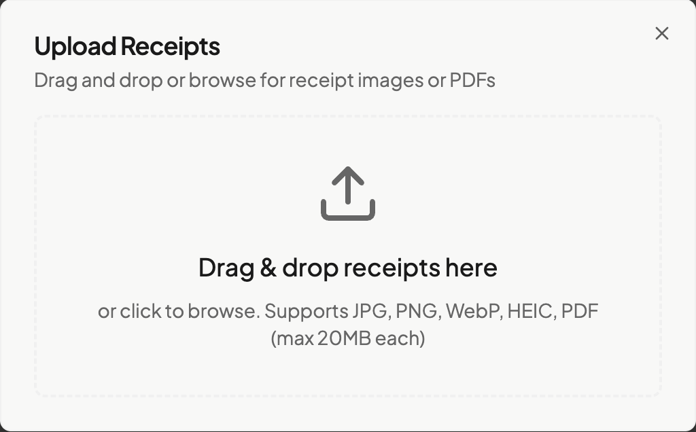

# Uploading Receipts

← [Back to Daily Use](../README.md) | [Receipts Section](./ai-extraction.md)

Learn all the ways to get your receipts into ExpenseFlow.

## Overview

ExpenseFlow accepts receipts in multiple formats and through several upload methods. Choose the approach that works best for your situation.

## Supported File Types

| Format | Extension | Notes |
|--------|-----------|-------|
| JPEG | .jpg, .jpeg | Most common for photos |
| PNG | .png | Good for screenshots |
| HEIC | .heic | iPhone photos |
| PDF | .pdf | Emailed or digital receipts |

**Maximum file size**: 25MB per file

> **Tip**: If your file is too large, see [Troubleshooting](../../04-reference/troubleshooting.md#upload-fails-with-file-too-large) for compression tips.

## Upload Methods

### Method 1: Drag and Drop

The fastest way to upload from your computer:

1. Navigate to the **Receipts** page
2. Open your file manager in a separate window
3. Select one or more receipt files
4. Drag them onto the upload zone
5. Release when you see the highlight

*Caption: Drag files onto the highlighted upload zone*

**Advantages**:
- Upload multiple files at once
- Works from any folder
- No additional clicks needed

### Method 2: File Browser

Click to browse and select files:

1. Navigate to the **Receipts** page
2. Click the **Upload** button or click anywhere in the upload zone
3. Browse to your receipt files
4. Select one or more files (hold Ctrl/Cmd for multiple)
5. Click **Open**

**Advantages**:
- Familiar interface
- Good for selecting specific files from many
- Works on all devices

### Method 3: Mobile Camera Capture

Take a photo directly in ExpenseFlow (mobile only):

1. Open ExpenseFlow on your mobile device
2. Navigate to **Receipts**
3. Tap the **Camera** icon in the upload zone
4. Allow camera access if prompted
5. Position the receipt within the frame:
   - Place on a flat, contrasting surface
   - Ensure good lighting
   - Keep edges visible
6. Tap to capture
7. Review the preview
8. Tap **Use Photo** or retake if needed

*Caption: Mobile camera capture with framing guide*

**Best practices for camera capture**:
- Use natural daylight when possible
- Avoid shadows across the receipt
- Flatten curled receipts
- Include all four corners in the frame

See [Mobile](../../04-reference/mobile.md) for more mobile features.

### Method 4: Email Forwarding (If Enabled)

Some organizations enable email upload:

1. Forward the receipt email to your assigned upload address
2. The receipt attachment is automatically extracted
3. It appears in your Receipts list within minutes

> **Note**: Email forwarding must be enabled by your administrator.

## Uploading Multiple Receipts

### Batch Upload

Upload many receipts at once:

1. Select all receipt files in your file manager
2. Drag them all to the upload zone, OR
3. Click Upload and select multiple files (Ctrl+click or Cmd+click)
4. All files upload and process in parallel

### Upload Queue

When uploading multiple files:

- Each file shows individual progress
- Processing happens in parallel (faster completion)
- Failed uploads can be retried individually
- The queue shows status for each file:
  - **Pending**: Waiting to start
  - **Uploading**: Transfer in progress
  - **Processing**: AI extraction running
  - **Complete**: Ready for review
  - **Failed**: Error occurred (click to retry)

## After Upload

Once a receipt uploads successfully:

1. **Processing begins**: AI analyzes the image (5-30 seconds)
2. **Extraction completes**: Vendor, date, and amount are identified
3. **Status updates**: Receipt shows "Complete" status
4. **Review available**: Click to see extracted data

See [AI Extraction](./ai-extraction.md) to learn about reviewing extracted data.

## Common Upload Issues

| Issue | Solution |
|-------|----------|
| File too large | Compress image or split PDF |
| Unsupported format | Convert to JPEG, PNG, or PDF |
| Upload fails | Check internet connection, retry |
| Stuck processing | Click Retry button after 5 minutes |

For detailed troubleshooting, see [Upload Troubleshooting](../../04-reference/troubleshooting.md#receipt-upload-issues).

## Best Practices

### For Clear Extractions

- **Good lighting**: Natural light or bright artificial light
- **Flat surface**: Prevent shadows and distortion
- **Full visibility**: Include all receipt edges
- **Clean lens**: Wipe your camera lens before capturing
- **Steady hand**: Avoid blur from movement

### For Organization

- **Upload promptly**: Don't let receipts pile up
- **Daily habit**: Upload receipts the day you receive them
- **Batch processing**: Upload all trip receipts together

## What's Next

After uploading receipts:

- [AI Extraction](./ai-extraction.md) - Understand and edit extracted data
- [Image Viewer](./image-viewer.md) - Zoom, rotate, and pan controls
- [Importing Statements](../statements/importing.md) - Add transactions to match against
- [Review Modes](../matching/review-modes.md) - Match receipts to transactions
