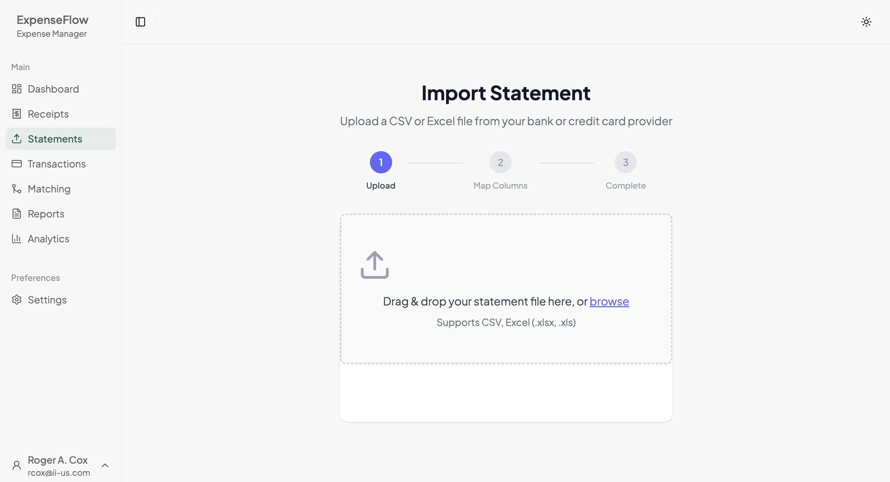

# Importing Statements

← [Back to Daily Use](../README.md) | [Statements Section](./column-mapping.md)

Import bank and credit card statements to create transactions for matching with receipts.

## Overview

ExpenseFlow's statement import wizard guides you through three steps to bring your transaction data into the system. Once imported, transactions can be matched with your uploaded receipts.

## Supported File Formats

| Format | Extension | Notes |
|--------|-----------|-------|
| CSV | .csv | Most common export format |
| Excel | .xlsx, .xls | Spreadsheet format |
| OFX | .ofx | Financial exchange format |
| QFX | .qfx | Quicken format |

> **Tip**: CSV is the most reliable format. If your bank offers multiple options, choose CSV.

## Step 1: Upload File

1. Navigate to the **Transactions** page
2. Click **Import Statement**
3. Select your statement file:
   - Drag and drop onto the upload zone, OR
   - Click to browse and select the file

   
   *Caption: Drag your statement file to the upload zone*

4. Wait for the file to upload
5. Click **Continue** to proceed to column mapping

### Download Tips

When downloading statements from your bank:

- Choose a date range that doesn't overlap with previous imports
- Select CSV or Excel format when available
- Download "detailed" or "expanded" format for more information
- Include transaction descriptions, not just amounts

## Step 2: Map Columns

ExpenseFlow needs to know which columns in your file contain each type of data.

*Caption: The column mapper showing sample data with dropdown selections*

### Required Fields

You must map these columns:

| Field | Description | Example Column Names |
|-------|-------------|---------------------|
| **Date** | Transaction date | "Trans Date", "Date", "Posted" |
| **Amount** | Dollar amount | "Amount", "Debit/Credit", "Value" |
| **Description** | Transaction details | "Description", "Memo", "Details" |

### Optional Fields

These improve matching accuracy if available:

| Field | Description | Benefit |
|-------|-------------|---------|
| **Merchant** | Vendor name (separate column) | Better AI matching |
| **Category** | Bank's category | Pre-populated suggestions |
| **Reference** | Transaction ID | Duplicate detection |

### Amount Configuration

Configure how your bank reports amounts:

**Sign Convention**:
- **Negative = Charges**: Purchases show as -$50.00 (most common)
- **Positive = Charges**: Purchases show as $50.00

**Separate Debit/Credit Columns**:
If your bank uses separate columns for debits and credits:
1. Map the debit column to **Debit Amount**
2. Map the credit column to **Credit Amount**
3. ExpenseFlow combines them automatically

### Mapping Tips

1. Use the **Sample Data** preview to verify your selections
2. If a column shows unusual data, try a different mapping
3. Scroll to see all available columns
4. Unmapped columns are ignored (no harm in leaving extras)

## Step 3: Review and Import

1. Review the **Transaction Preview** showing sample imported data
2. Verify the data looks correct:
   - Dates are in the right format
   - Amounts show proper values
   - Descriptions are readable
3. Check the **Import Summary**:
   - Total transactions to import
   - Date range covered
   - Any warnings about duplicates
4. Click **Import** to complete

### Duplicate Detection

ExpenseFlow automatically checks for duplicates:

- **Same date, amount, and description**: Likely duplicate, skipped
- **Similar transactions**: Warning displayed, you decide
- **New transactions**: Imported normally

> **Tip**: If you accidentally import duplicates, you can delete them from the Transactions page.

## Save as Fingerprint

After completing the column mapping, save it for future use:

1. Before clicking Import, look for **Save as Template**
2. Click and enter a name (e.g., "Chase Business Visa")
3. The mapping is saved as a [Fingerprint](../../04-reference/glossary.md#fingerprint)
4. Next time, select the fingerprint to auto-apply settings

See [Fingerprints](./fingerprints.md) for template management details.

## After Import

Once import completes:

1. Transactions appear on the **Transactions** page
2. ExpenseFlow runs auto-matching against your receipts
3. Match proposals appear in the **Matching** page
4. The import summary shows total transactions added

## Common Import Issues

| Issue | Solution |
|-------|----------|
| "Invalid CSV" error | Re-export with UTF-8 encoding |
| Missing columns | Check file has header row |
| Wrong date format | Verify date column selection |
| All amounts zero | Check amount sign configuration |
| Duplicates imported | Delete extras from Transactions |

For detailed solutions, see [Statement Troubleshooting](../../04-reference/troubleshooting.md#statement-import-issues).

## What's Next

After importing a statement:

- [Column Mapping](./column-mapping.md) - Deep dive into mapping options
- [Fingerprints](./fingerprints.md) - Save templates for repeat imports
- [Filtering](../transactions/filtering.md) - Find specific transactions
- [Review Modes](../matching/review-modes.md) - Match transactions to receipts
