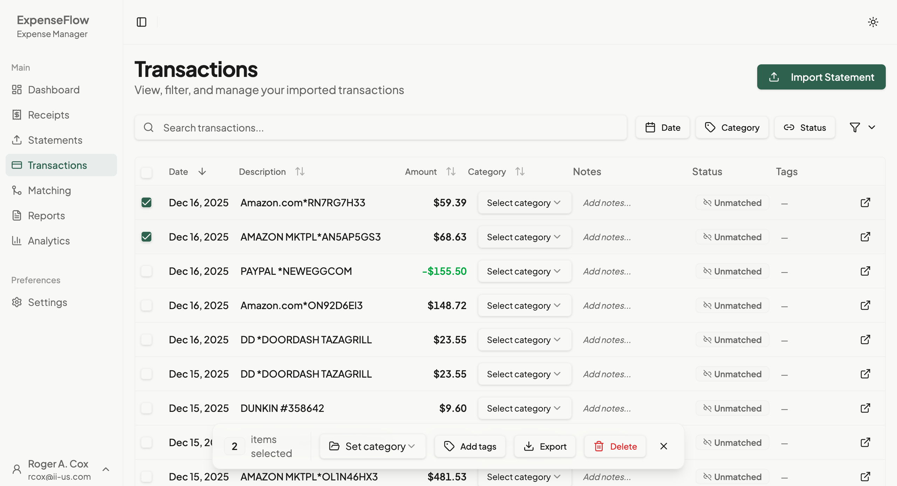

# Bulk Operations

Perform actions on multiple transactions at once.

## Overview

Bulk operations let you categorize, tag, export, or delete multiple transactions simultaneously. This saves time when processing many similar transactions.

## Selecting Transactions

### Individual Selection

1. Click the checkbox next to each transaction
2. Selected items show a checkmark
3. The selection count appears in the toolbar

### Select All (Visible)

1. Click the checkbox in the header row
2. All currently visible transactions are selected
3. Use with filters for targeted selection

### Select All (Filtered)

When filters are active:

1. Filter to show desired transactions
2. Click "Select all X matching"
3. All transactions matching filters are selected (even beyond current page)

*Caption: The bulk actions toolbar appears when transactions are selected*

## Bulk Actions Toolbar

When transactions are selected, a floating action bar appears:

| Action | Icon | Description |
|--------|------|-------------|
| **Categorize** | Tag | Assign category to all selected |
| **Add Tags** | Label | Add tags to all selected |
| **Export** | Download | Export selected to file |
| **Delete** | Trash | Remove selected transactions |

## Categorizing Multiple Transactions

Assign the same category to many transactions:

1. Select the transactions to categorize
2. Click **Categorize** in the action bar
3. Choose from available categories:
   - Standard categories (Meals, Travel, etc.)
   - Custom categories you've created
   - Search to find specific categories
4. Click **Apply**
5. All selected transactions update

**Use case**: Categorize all office supply purchases for the month

## Adding Tags

Add one or more tags to selected transactions:

1. Select transactions
2. Click **Add Tags**
3. Select existing tags or create new ones:
   - Click existing tags to add them
   - Type a new tag name and press Enter to create
4. Click **Apply**

**Tag examples**:
- "Project: Website Redesign"
- "Client: Acme Corp"
- "Reimbursable"
- "Business Meal"

> **Note**: Adding tags doesn't remove existing tags. It adds to them.

## Exporting Transactions

Export selected transactions to a file:

1. Select transactions to export
2. Click **Export**
3. Choose format:
   - **Excel (.xlsx)**: For spreadsheet analysis
   - **CSV (.csv)**: For import into other systems
   - **PDF (.pdf)**: For printing or sharing
4. Click **Download**
5. File downloads to your browser's download location

**Exported data includes**:
- Transaction date
- Description
- Amount
- Category
- Tags
- Match status
- Notes

## Deleting Transactions

Remove unwanted transactions:

1. Select transactions to delete
2. Click **Delete**
3. Review the confirmation dialog:
   - Shows count of transactions to delete
   - Warns about matched receipts (if any)
4. Click **Confirm Delete**

> **Warning**: Deleted transactions cannot be recovered. If transactions are matched to receipts, the matches will also be removed.

### When to Delete

- Duplicate transactions from re-import
- Test or erroneous data
- Personal transactions mixed with business

### When NOT to Delete

- Matched transactions (unmatch first if needed)
- Transactions already in submitted reports
- Data you might need for auditing

## Bulk Operation Tips

### Filter First

1. Use [filters](./filtering.md) to narrow down transactions
2. Select all filtered results
3. Apply bulk action to the focused set

### Work in Batches

For large operations:
1. Filter to a subset (e.g., one month)
2. Apply bulk action
3. Repeat for next subset

### Verify Before Acting

1. Review the selection count
2. Scroll through selected items
3. Confirm filters are correct
4. Then apply the action

## Undo Bulk Operations

Some operations can be undone:

| Operation | Undoable? |
|-----------|-----------|
| Categorize | Yes (re-categorize) |
| Add Tags | Yes (remove tags) |
| Export | N/A (no changes) |
| Delete | **No** |

## Keyboard Shortcuts

| Key | Action |
|-----|--------|
| **Space** | Toggle selection on focused row |
| **Ctrl+A** | Select all visible |
| **Esc** | Clear selection |
| **Delete** | Delete selected (with confirmation) |

## What's Next

After bulk operations:

- [Filtering](./filtering.md) - Refine your transaction view
- [Sorting](./sorting.md) - Organize transactions
- [Matching](../matching/review-modes.md) - Match transactions to receipts
