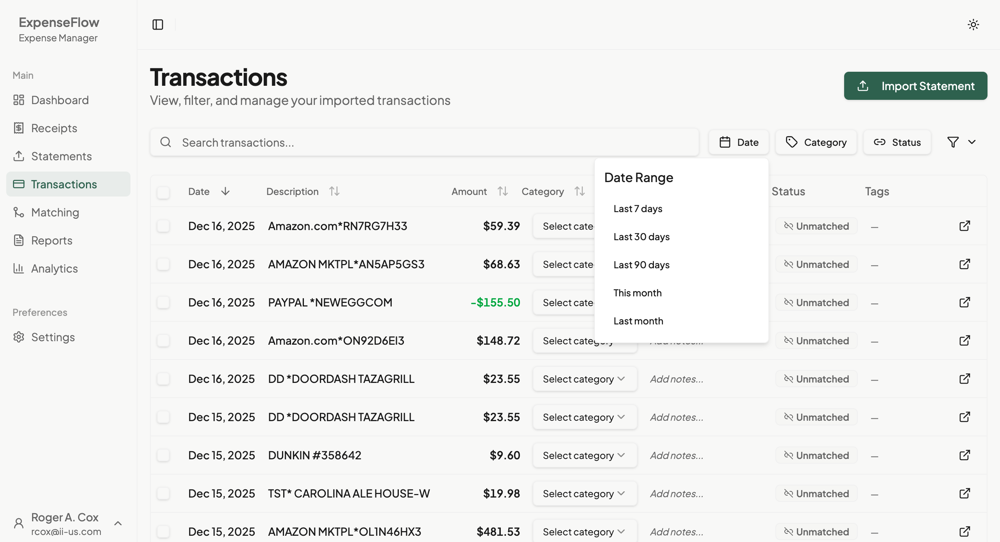

# Filtering Transactions

Find specific transactions using ExpenseFlow's filtering tools.

## Overview

The filter panel helps you narrow down transactions by date, amount, category, status, and more. Use filters to find specific expenses or group transactions for bulk operations.

## Accessing Filters

1. Navigate to the **Transactions** page
2. Click the **Filter** button or filter icon
3. The filter panel opens on the left side

*Caption: The expanded filter panel showing all filter options*

## Available Filters

### Date Range

Filter by transaction date:

1. Click **Date Range**
2. Choose a preset or custom range:

| Preset | Description |
|--------|-------------|
| Today | Current day only |
| This Week | Monday to today |
| This Month | 1st to today |
| Last Month | Previous calendar month |
| This Quarter | Current 3-month period |
| Custom | Select specific start/end dates |

3. For custom dates:
   - Click the start date picker
   - Select start date
   - Click the end date picker
   - Select end date
4. Click **Apply**

### Amount Range

Filter by dollar amount:

1. Click **Amount**
2. Enter minimum and/or maximum:
   - **Min**: Only show transactions ≥ this amount
   - **Max**: Only show transactions ≤ this amount
3. Click **Apply**

Examples:
- Large expenses: Min $100, Max empty
- Under $50: Min empty, Max $50
- Between $20-$100: Min $20, Max $100

### Category

Filter by expense category:

1. Click **Category**
2. Select one or more categories:
   - Click to select
   - Click again to deselect
   - Select multiple for "any of these"
3. Click **Apply**

Common categories:
- Meals & Entertainment
- Travel
- Office Supplies
- Software & Subscriptions
- Professional Services

### Match Status

Filter by matching state:

| Status | Shows |
|--------|-------|
| **Unmatched** | Transactions without linked receipts |
| **Matched** | Transactions with confirmed receipt links |
| **Pending Match** | Transactions with proposed (unconfirmed) matches |
| **All** | No status filter |

### Tags

Filter by applied tags:

1. Click **Tags**
2. Select one or more tags from your tag list
3. Choose match mode:
   - **Any**: Transactions with any selected tag
   - **All**: Transactions with all selected tags
4. Click **Apply**

### Vendor/Merchant

Search by vendor name:

1. Click **Vendor** or use the search box
2. Type part of the vendor name
3. Matching transactions display
4. Works with partial matches (e.g., "Star" finds "Starbucks")

## Combining Filters

Filters work together with AND logic:

**Example**: Find all Starbucks purchases over $10 this month

1. Date Range: This Month
2. Amount: Min $10
3. Vendor: "Starbucks"

Result: Only transactions matching ALL criteria

## Search Box

Quick search across all fields:

1. Type in the search box at the top
2. Searches across:
   - Description
   - Vendor/Merchant
   - Amount
   - Category
   - Notes
3. Results update as you type

## Filter Presets

### Saving Filter Presets

Save commonly used filter combinations:

1. Configure your desired filters
2. Click **Save Preset** (star icon)
3. Name the preset (e.g., "Travel Expenses Q4")
4. Click **Save**

### Applying Saved Presets

1. Click **Presets** dropdown
2. Select your saved preset
3. Filters auto-apply

### Managing Presets

1. Go to **Settings** > **Filter Presets**
2. View, rename, or delete saved presets

## Clearing Filters

### Clear Individual Filters

- Click the **X** next to any active filter chip

### Clear All Filters

- Click **Clear All** in the filter panel
- Or click the **X** on the "Filters active" indicator

## Filter Results

### Result Count

The transaction count updates based on filters:
- "Showing 47 of 312 transactions"
- Updates in real-time as filters change

### No Results

If no transactions match your filters:

1. Check that filters aren't too restrictive
2. Try broadening date range
3. Remove one filter at a time
4. Verify transactions exist for the criteria

## Keyboard Shortcuts

| Key | Action |
|-----|--------|
| **/** | Focus search box |
| **Esc** | Close filter panel |
| **Ctrl+Shift+F** | Toggle filter panel |

## What's Next

After filtering transactions:

- [Bulk Operations](./bulk-operations.md) - Act on filtered results
- [Sorting](./sorting.md) - Organize filtered transactions
- [Matching](../matching/review-modes.md) - Match unmatched transactions
