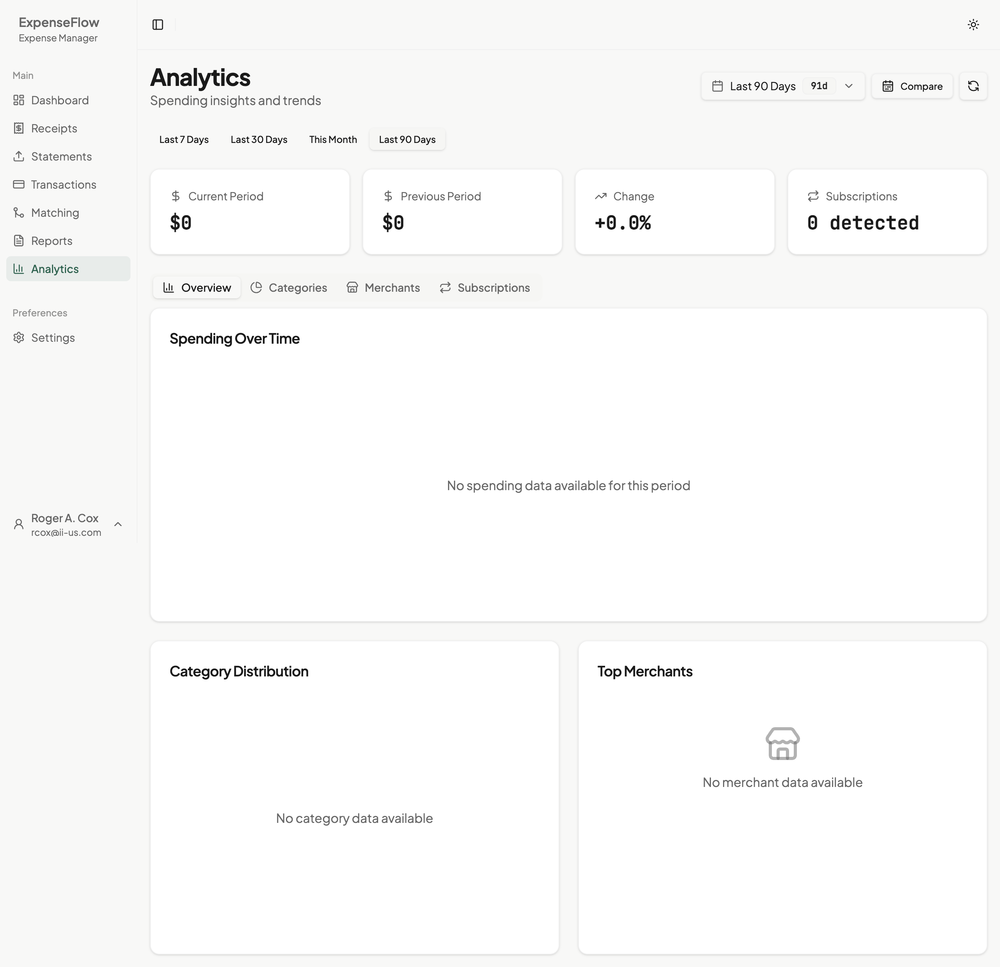

# Analytics Dashboard

← [Back to Monthly Close](../README.md) | [Analytics Section](./trends.md)

Visualize your spending patterns and track expenses over time.

## Overview

The Analytics Dashboard provides visual insights into your expense data. View spending trends, category breakdowns, and compare across time periods to understand where your money goes.

## Accessing Analytics

1. Click **Analytics** in the main navigation
2. Or click **View Analytics** from the Dashboard metrics section

### Expense Patterns

From the Analytics page, click **Expense Patterns** in the header to manage your learned expense patterns. See [Pattern Management](../../02-daily-use/predictions/pattern-management.md) for details.

## Dashboard Components

### Summary Cards

At the top of the analytics view, summary cards show:

| Card | Shows |
|------|-------|
| **Total Spending** | Sum for the selected period |
| **Average per Day** | Daily spending average |
| **Top Category** | Highest spending category |
| **Expense Count** | Number of transactions |

### Main Chart

The central chart displays spending over time:

- **X-axis**: Dates (days, weeks, or months depending on range)
- **Y-axis**: Amount in dollars
- **Hover**: See exact values for any data point
- **Click**: Drill down to that day's expenses

*Caption: The analytics dashboard with summary cards and trend chart*

### Category Breakdown

Below the main chart, a breakdown shows:

- Pie or donut chart of spending by category
- Percentage of total for each category
- Click any segment to filter the trend chart

## Date Range Selection

### Quick Ranges

Select common periods quickly:

- **This Week**: Current week (Sunday to today)
- **This Month**: Current calendar month
- **Last Month**: Previous calendar month
- **Last 30 Days**: Rolling 30-day window
- **Last 90 Days**: Rolling quarter
- **Year to Date**: January 1 to today

### Custom Range

For specific periods:

1. Click **Custom** in the date picker
2. Select start date
3. Select end date
4. Click **Apply**

> **Tip**: Custom ranges are useful for project-based expense tracking or specific billing cycles.

## Chart Interactions

### Zooming

- **Click and drag** on the chart to zoom into a period
- **Double-click** to reset zoom

### Toggling Categories

- Click category names in the legend to show/hide them
- Useful for focusing on specific expense types

### Exporting Chart

- Click the **Export** icon to save as:
  - PNG image
  - PDF document
  - CSV data

## Understanding the Data

### What's Included

Analytics show:

- All [matched](../../02-daily-use/matching/review-modes.md) expenses
- Expenses from submitted/approved reports
- Data from the selected date range only

### What's Not Included

- Unmatched receipts (not yet linked to transactions)
- Transactions without confirmed matches
- Future-dated expenses

## Common Views

### Monthly Budget Review

1. Select **This Month**
2. Check Total Spending against your budget
3. Review Category Breakdown for overspending

### Quarterly Analysis

1. Select **Last 90 Days**
2. Look for spending trends (increasing/decreasing)
3. Compare categories quarter-over-quarter

### Year-End Summary

1. Select **Year to Date**
2. Export chart for annual review
3. Use [Categories Analysis](./categories.md) for detailed breakdown

## What's Next

After reviewing the dashboard:

- [Trends Analysis](./trends.md) - Compare periods and spot patterns
- [Category Breakdown](./categories.md) - Deep dive into spending categories
- [Generating Reports](../reports/generating.md) - Create formal reports
- [Pattern Management](../../02-daily-use/predictions/pattern-management.md) - View and manage expense patterns

