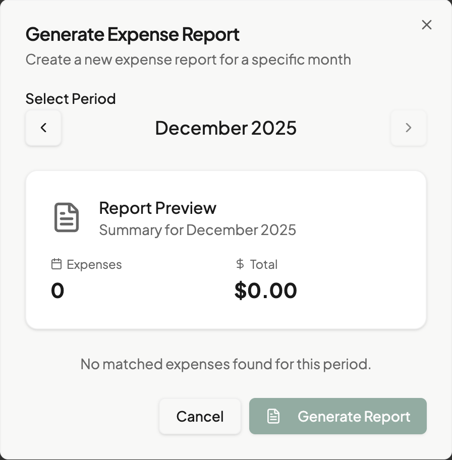

# Generating Reports

← [Back to Monthly Close](../README.md) | [Reports Section](./status-workflow.md)

Create expense reports from your matched expenses.

## Overview

An [Expense Report](../../04-reference/glossary.md#expense-report) collects your matched expenses for a time period into a single submission. Reports go through a status workflow from Draft to Approved.

## Creating a New Report

### Step 1: Open Report Generation

1. Navigate to **Reports**
2. Click **New Report** or **Generate Report**

*Caption: The report generation dialog with month selection*

### Step 2: Select Time Period

Choose which expenses to include:

**By Month**:
- Select year and month from dropdowns
- All matched expenses in that month are included

**By Date Range** (if available):
- Choose custom start and end dates
- Useful for non-monthly reporting cycles

### Step 3: Review Included Expenses

The dialog shows:
- **Total expenses**: Count of matched items
- **Total amount**: Sum of all expenses
- **By category**: Breakdown by expense type
- **Missing items**: Unmatched expenses (if any)

> **Warning**: Only matched expenses appear in reports. [Match](../02-daily-use/matching/review-modes.md) your receipts first.

### Step 4: Add Report Notes (Optional)

Include notes for approvers:
- Travel purposes
- Project references
- Special circumstances
- Explanation of unusual expenses

### Step 5: Create Report

1. Review the summary
2. Click **Create Report**
3. The report is created in **Draft** status

## What's Included in Reports

### Automatically Included

- All matched expenses in the date range
- Receipt images
- Transaction details
- Categories and GL codes
- Split allocations (if any)

### Not Included

- Unmatched receipts
- Unmatched transactions
- Expenses from other date ranges
- Items already in another report

## Report Contents

Each report contains:

| Section | Contents |
|---------|----------|
| **Summary** | Total amount, date range, expense count |
| **By Category** | Breakdown by expense type |
| **Line Items** | Individual expense details |
| **Receipts** | Attached receipt images |
| **Notes** | Your added comments |

## After Creating a Report

Once created:

1. Report appears in your Reports list
2. Status shows **Draft**
3. You can edit, add notes, or delete
4. Submit when ready for approval

See [Status Workflow](./status-workflow.md) for next steps.

## Editing Draft Reports

While in Draft status, you can:

- **Add notes**: Click Edit Notes
- **Remove expenses**: Uncheck items (if supported)
- **Delete report**: Start fresh if needed

> **Note**: Once submitted, editing is limited or disabled.

## Common Issues

### "No Expenses Found"

- Verify you have matched expenses for the selected period
- Check that dates are correct
- Match pending receipts and transactions first

### Missing Expenses

If expected expenses don't appear:
1. Check they're matched (not just uploaded/imported)
2. Verify dates fall within the selected range
3. Ensure they're not in another report

### Report Amount Seems Wrong

1. Review the line items list
2. Check for missing matches
3. Verify split allocations if used
4. Look for duplicate transactions

## What's Next

After generating a report:

- [Status Workflow](./status-workflow.md) - Submit and track approval
- [Exporting](./exporting.md) - Download as PDF or Excel
