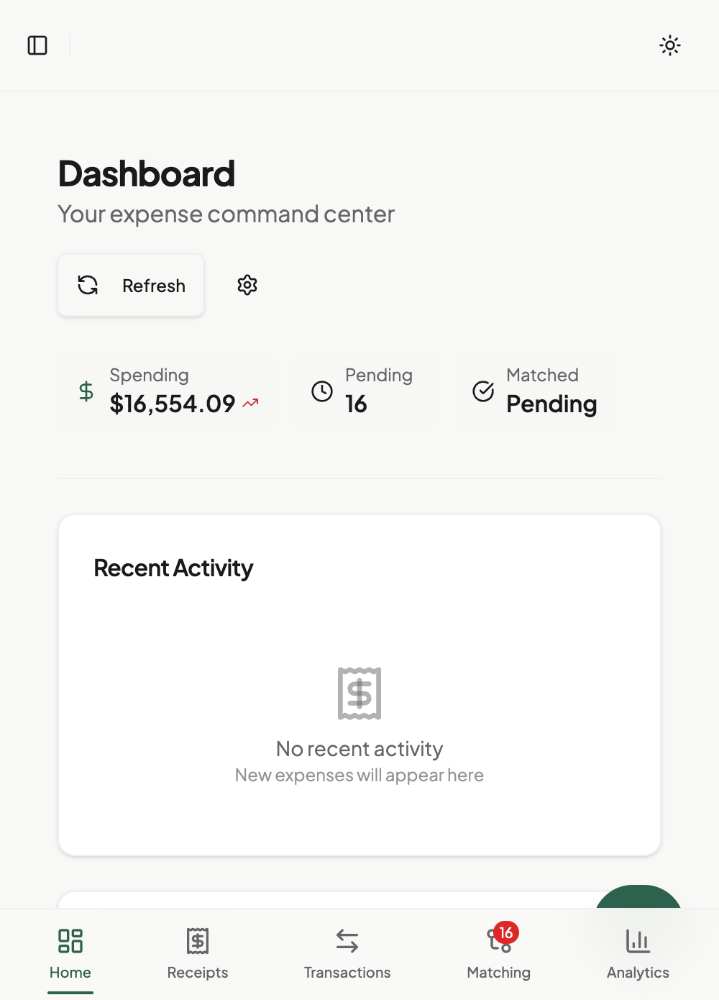
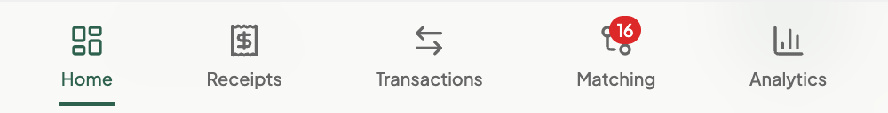

# Mobile Usage

← [Back to Reference](./README.md)

Use ExpenseFlow on your phone or tablet for on-the-go expense management.

## Overview

ExpenseFlow's responsive design works on any mobile device. Capture receipts instantly, review matches, and manage expenses from anywhere.

## Mobile Features

| Feature | Mobile Optimized |
|---------|------------------|
| Receipt capture | ✓ Camera integration |
| Upload queue | ✓ Background processing |
| Match review | ✓ Swipe actions |
| Dashboard | ✓ Touch-friendly metrics |
| Reports | ✓ View and export |
| Analytics | ✓ Responsive charts |

## Accessing on Mobile

### Browser Access

Use your mobile browser:

1. Open Safari (iOS) or Chrome (Android)
2. Navigate to your ExpenseFlow URL
3. Sign in with Microsoft SSO
4. Bookmark for easy access

### Add to Home Screen

Create an app-like experience:

**iOS (Safari)**:
1. Open ExpenseFlow in Safari
2. Tap the Share button
3. Select **Add to Home Screen**
4. Name it "ExpenseFlow"
5. Tap **Add**

**Android (Chrome)**:
1. Open ExpenseFlow in Chrome
2. Tap the menu (three dots)
3. Select **Add to Home Screen**
4. Confirm the name
5. Tap **Add**

## Mobile Interface

*Caption: ExpenseFlow dashboard optimized for mobile*

### Navigation

#### Bottom Navigation Bar

*Caption: Mobile bottom navigation with primary actions*

| Icon | Destination |
|------|-------------|
| **Home** | Dashboard |
| **Receipts** | Receipt list |
| **+** | Quick upload |
| **Matching** | Review proposals |
| **More** | Additional options |

#### Hamburger Menu

Tap the menu icon (☰) for:

- Transactions
- Reports
- Analytics
- Settings
- Help

### Touch Interactions

| Gesture | Action |
|---------|--------|
| **Tap** | Select item |
| **Long press** | Open context menu |
| **Swipe left** | Reject (in match review) |
| **Swipe right** | Approve (in match review) |
| **Pull down** | Refresh content |
| **Pinch** | Zoom receipt images |

## Capturing Receipts

### Quick Capture

The fastest way to add receipts:

1. Tap the **+** button in navigation
2. Camera opens automatically
3. Position receipt in frame
4. Tap capture button
5. Review and confirm
6. Receipt uploads in background

### Camera Tips

For best results:

| Do | Don't |
|----|-------|
| Flat surface | Crumpled receipts |
| Good lighting | Deep shadows |
| Entire receipt in frame | Cut off edges |
| Steady hands | Blurry images |
| Contrasting background | Same-color surface |

### From Photo Library

If you already have a photo:

1. Tap **+** button
2. Select **Photo Library**
3. Choose receipt image(s)
4. Confirm upload

### Batch Capture

Capture multiple receipts:

1. Tap **+** button
2. Select **Batch Mode**
3. Capture multiple receipts
4. Review all captures
5. Upload as batch

## Upload Queue

### Background Uploads

*Caption: Upload queue showing processing status*

Uploads continue in background:

- Close ExpenseFlow
- Switch to other apps
- Uploads complete automatically
- Notification when done

### Queue Status

View upload status:

1. Tap the queue icon (or pull down dashboard)
2. See pending, processing, completed
3. Retry failed uploads

### Offline Mode

When offline:

- Capture receipts normally
- They queue locally
- Upload automatically when online
- No data loss

## Swipe Actions

### In Match Review

*Caption: Swipe right to approve, left to reject*

| Direction | Action |
|-----------|--------|
| **Swipe Right** | Approve match |
| **Swipe Left** | Reject match |
| **Tap** | View details |

### In Transaction List

| Direction | Action |
|-----------|--------|
| **Swipe Left** | Delete |
| **Swipe Right** | Quick categorize |
| **Long Press** | Multi-select |

## Mobile Dashboard

### Metric Cards

Tap any metric to:

- See detailed breakdown
- Navigate to related page
- View trend information

### Activity Feed

Scrolls vertically:

- Latest activity at top
- Tap item to view details
- Pull down to refresh

### Action Queue

Priority items first:

- Most urgent at top
- Tap to process
- Swipe to dismiss

## Reports on Mobile

### Viewing Reports

- Full report list
- Tap to view details
- Status indicators visible

### Creating Reports

Simple report creation:

1. Go to Reports
2. Tap **New Report**
3. Select month/period
4. Review included expenses
5. Submit

### Exporting

Export options available:

- PDF downloads to device
- Excel downloads to device
- Share via email or apps

## Analytics on Mobile

### Charts

Responsive chart behavior:

- Tap and hold for values
- Pinch to zoom time range
- Rotate device for wider view

### Landscape Mode

For better chart viewing:

1. Rotate device to landscape
2. Charts expand horizontally
3. More data points visible

## Touch-Friendly Elements

### Larger Tap Targets

Mobile interface features:

- Bigger buttons
- More spacing between items
- Easy scrolling
- Thumb-friendly placement

### Input Fields

Mobile keyboards:

- Numeric keyboard for amounts
- Date picker for dates
- Search with suggestions

## Notifications

### Push Notifications (if enabled)

Receive alerts for:

- Upload complete
- New match proposals
- Report status changes
- Subscription renewals

### Enabling Notifications

1. First visit: Browser prompts for permission
2. Allow notifications
3. Configure in Settings → Notifications

## Battery & Data

### Optimizing Battery

- Large uploads use battery
- Upload on WiFi when possible
- Close app fully when not using

### Data Usage

- Receipt uploads: ~1-3 MB each
- Dashboard: ~200 KB refresh
- Enable "Reduce Data" in settings for slower connections

## Troubleshooting Mobile

### Camera Won't Open

1. Check browser permissions
2. Settings → Safari/Chrome → Camera
3. Enable for ExpenseFlow domain

### Uploads Failing

1. Check internet connection
2. Try WiFi instead of cellular
3. Reduce image quality in settings
4. Clear browser cache

### App Feels Slow

1. Close other apps
2. Restart browser
3. Clear ExpenseFlow cache
4. Update browser to latest version

### Can't Sign In

1. Use incognito/private mode
2. Clear cookies and cache
3. Check company VPN if required
4. Try desktop browser first

## Best Practices

### Capture Immediately

- Photograph receipts right away
- Queue uploads for later
- Don't rely on paper

### Review Daily

- 5 minutes each evening
- Process match proposals
- Keep queue clear

### Use WiFi for Uploads

- Faster uploads
- Saves mobile data
- More reliable

## What's Next

After understanding mobile features:

- [Quick Start](../01-getting-started/quick-start.md) - Try your first upload
- [Uploading Receipts](../02-daily-use/receipts/uploading.md) - All upload methods
- [Match Review](../02-daily-use/matching/review-modes.md) - Learn swipe actions

