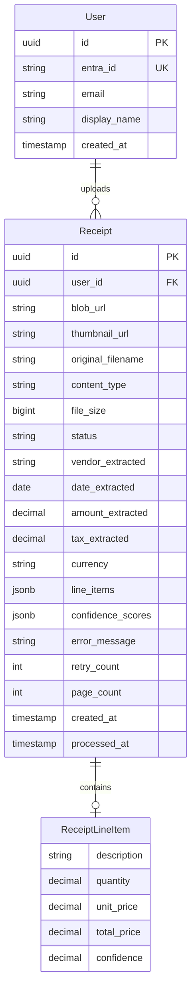
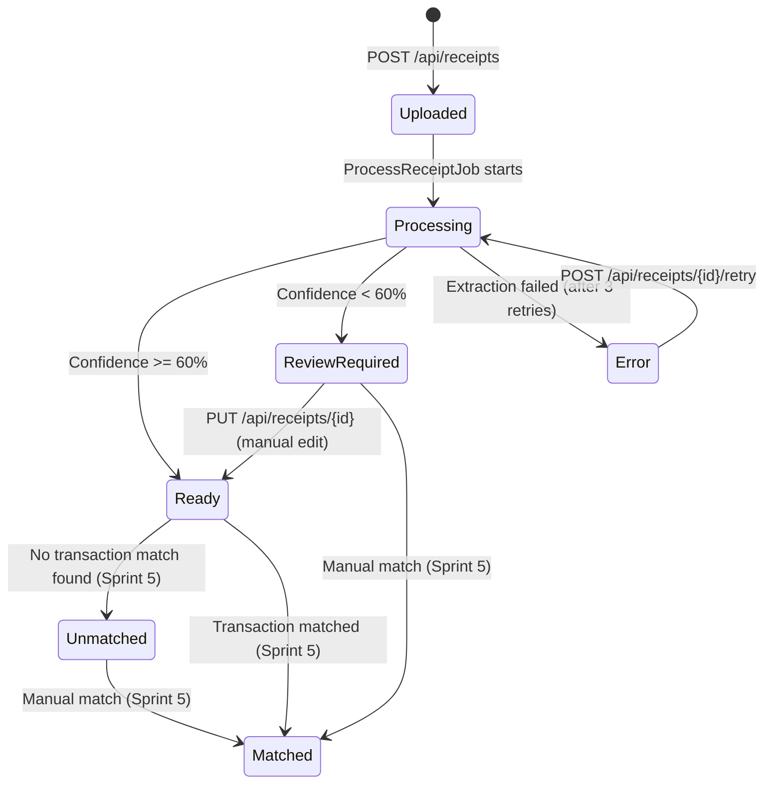

# Data Model: Receipt Upload Pipeline

**Date**: 2025-12-05
**Feature Branch**: `003-receipt-pipeline`

## Entity Relationship Diagram



## Entities

### Receipt

Represents an uploaded receipt document with OCR extraction results.

| Field | Type | Constraints | Description |
|-------|------|-------------|-------------|
| id | UUID | PK, DEFAULT gen_random_uuid() | Unique identifier |
| user_id | UUID | FK → users(id), NOT NULL | Owner of the receipt |
| blob_url | VARCHAR(500) | NOT NULL | Full URL to blob in Azure Storage |
| thumbnail_url | VARCHAR(500) | NULLABLE | URL to 200x200 thumbnail |
| original_filename | VARCHAR(255) | NOT NULL | Original uploaded filename |
| content_type | VARCHAR(100) | NOT NULL | MIME type (image/jpeg, application/pdf, etc.) |
| file_size | BIGINT | NOT NULL | File size in bytes |
| status | VARCHAR(50) | NOT NULL, DEFAULT 'Uploaded' | Processing status enum |
| vendor_extracted | VARCHAR(255) | NULLABLE | Extracted vendor/merchant name |
| date_extracted | DATE | NULLABLE | Extracted transaction date |
| amount_extracted | DECIMAL(12,2) | NULLABLE | Extracted total amount |
| tax_extracted | DECIMAL(12,2) | NULLABLE | Extracted tax amount |
| currency | VARCHAR(3) | NULLABLE, DEFAULT 'USD' | Currency code (ISO 4217) |
| line_items | JSONB | NULLABLE | Array of extracted line items |
| confidence_scores | JSONB | NULLABLE | Field-level confidence scores |
| error_message | TEXT | NULLABLE | Error description if extraction failed |
| retry_count | INTEGER | NOT NULL, DEFAULT 0 | Number of extraction retry attempts |
| page_count | INTEGER | NULLABLE, DEFAULT 1 | Number of pages in document |
| created_at | TIMESTAMP | NOT NULL, DEFAULT NOW() | Upload timestamp |
| processed_at | TIMESTAMP | NULLABLE | Extraction completion timestamp |

### Receipt Status Enum

```csharp
public enum ReceiptStatus
{
    Uploaded,        // File uploaded, awaiting processing
    Processing,      // Document Intelligence extraction in progress
    Ready,           // Extraction complete, confidence >= 60%
    ReviewRequired,  // Extraction complete, confidence < 60%
    Error,           // Extraction failed after retries
    Unmatched,       // Ready but not yet matched to transaction (Sprint 5)
    Matched          // Matched to transaction (Sprint 5)
}
```

### ReceiptLineItem (JSONB Structure)

Stored as JSONB array within `Receipt.line_items`:

```json
[
  {
    "description": "Coffee Large",
    "quantity": 2.0,
    "unit_price": 4.50,
    "total_price": 9.00,
    "confidence": 0.92
  },
  {
    "description": "Croissant",
    "quantity": 1.0,
    "unit_price": 3.25,
    "total_price": 3.25,
    "confidence": 0.88
  }
]
```

### Confidence Scores (JSONB Structure)

Stored as JSONB object within `Receipt.confidence_scores`:

```json
{
  "vendor": 0.95,
  "date": 0.98,
  "amount": 0.92,
  "tax": 0.85,
  "overall": 0.91
}
```

## Indexes

```sql
-- Primary lookup by user
CREATE INDEX idx_receipts_user_id ON receipts(user_id);

-- Filter by status (common query pattern)
CREATE INDEX idx_receipts_status ON receipts(status);

-- Composite for user + status filtering
CREATE INDEX idx_receipts_user_status ON receipts(user_id, status);

-- Date range queries
CREATE INDEX idx_receipts_created_at ON receipts(created_at DESC);

-- For unmatched receipts endpoint
CREATE INDEX idx_receipts_unmatched ON receipts(user_id, status)
WHERE status = 'Unmatched';
```

## PostgreSQL Migration

```sql
-- Migration: CreateReceiptsTable
-- Sprint: 003-receipt-pipeline

CREATE TABLE IF NOT EXISTS receipts (
    id UUID PRIMARY KEY DEFAULT gen_random_uuid(),
    user_id UUID NOT NULL REFERENCES users(id) ON DELETE CASCADE,
    blob_url VARCHAR(500) NOT NULL,
    thumbnail_url VARCHAR(500),
    original_filename VARCHAR(255) NOT NULL,
    content_type VARCHAR(100) NOT NULL,
    file_size BIGINT NOT NULL,
    status VARCHAR(50) NOT NULL DEFAULT 'Uploaded',
    vendor_extracted VARCHAR(255),
    date_extracted DATE,
    amount_extracted DECIMAL(12,2),
    tax_extracted DECIMAL(12,2),
    currency VARCHAR(3) DEFAULT 'USD',
    line_items JSONB,
    confidence_scores JSONB,
    error_message TEXT,
    retry_count INTEGER NOT NULL DEFAULT 0,
    page_count INTEGER DEFAULT 1,
    created_at TIMESTAMP NOT NULL DEFAULT NOW(),
    processed_at TIMESTAMP,

    CONSTRAINT chk_status CHECK (status IN (
        'Uploaded', 'Processing', 'Ready', 'ReviewRequired',
        'Error', 'Unmatched', 'Matched'
    )),
    CONSTRAINT chk_file_size CHECK (file_size > 0 AND file_size <= 26214400),
    CONSTRAINT chk_retry_count CHECK (retry_count >= 0 AND retry_count <= 3)
);

-- Indexes
CREATE INDEX idx_receipts_user_id ON receipts(user_id);
CREATE INDEX idx_receipts_status ON receipts(status);
CREATE INDEX idx_receipts_user_status ON receipts(user_id, status);
CREATE INDEX idx_receipts_created_at ON receipts(created_at DESC);
CREATE INDEX idx_receipts_unmatched ON receipts(user_id, status)
WHERE status = 'Unmatched';

-- Enable Row Level Security
ALTER TABLE receipts ENABLE ROW LEVEL SECURITY;

-- Policy: Users can only access their own receipts
CREATE POLICY receipts_user_isolation ON receipts
    FOR ALL
    USING (user_id = current_setting('app.current_user_id')::UUID);
```

## Entity Framework Core Model

```csharp
public class Receipt
{
    public Guid Id { get; set; }
    public Guid UserId { get; set; }
    public string BlobUrl { get; set; } = null!;
    public string? ThumbnailUrl { get; set; }
    public string OriginalFilename { get; set; } = null!;
    public string ContentType { get; set; } = null!;
    public long FileSize { get; set; }
    public ReceiptStatus Status { get; set; } = ReceiptStatus.Uploaded;
    public string? VendorExtracted { get; set; }
    public DateOnly? DateExtracted { get; set; }
    public decimal? AmountExtracted { get; set; }
    public decimal? TaxExtracted { get; set; }
    public string Currency { get; set; } = "USD";
    public List<ReceiptLineItem>? LineItems { get; set; }
    public Dictionary<string, double>? ConfidenceScores { get; set; }
    public string? ErrorMessage { get; set; }
    public int RetryCount { get; set; }
    public int PageCount { get; set; } = 1;
    public DateTime CreatedAt { get; set; } = DateTime.UtcNow;
    public DateTime? ProcessedAt { get; set; }

    // Navigation property
    public User User { get; set; } = null!;
}

public class ReceiptLineItem
{
    public string Description { get; set; } = null!;
    public decimal? Quantity { get; set; }
    public decimal? UnitPrice { get; set; }
    public decimal? TotalPrice { get; set; }
    public double? Confidence { get; set; }
}
```

## EF Core Configuration

```csharp
public class ReceiptConfiguration : IEntityTypeConfiguration<Receipt>
{
    public void Configure(EntityTypeBuilder<Receipt> builder)
    {
        builder.ToTable("receipts");

        builder.HasKey(r => r.Id);
        builder.Property(r => r.Id).HasDefaultValueSql("gen_random_uuid()");

        builder.Property(r => r.BlobUrl).HasMaxLength(500).IsRequired();
        builder.Property(r => r.ThumbnailUrl).HasMaxLength(500);
        builder.Property(r => r.OriginalFilename).HasMaxLength(255).IsRequired();
        builder.Property(r => r.ContentType).HasMaxLength(100).IsRequired();
        builder.Property(r => r.Status)
            .HasMaxLength(50)
            .HasConversion<string>()
            .HasDefaultValue(ReceiptStatus.Uploaded);
        builder.Property(r => r.VendorExtracted).HasMaxLength(255);
        builder.Property(r => r.AmountExtracted).HasPrecision(12, 2);
        builder.Property(r => r.TaxExtracted).HasPrecision(12, 2);
        builder.Property(r => r.Currency).HasMaxLength(3).HasDefaultValue("USD");
        builder.Property(r => r.LineItems).HasColumnType("jsonb");
        builder.Property(r => r.ConfidenceScores).HasColumnType("jsonb");
        builder.Property(r => r.PageCount).HasDefaultValue(1);
        builder.Property(r => r.CreatedAt).HasDefaultValueSql("NOW()");

        // Indexes
        builder.HasIndex(r => r.UserId);
        builder.HasIndex(r => r.Status);
        builder.HasIndex(r => new { r.UserId, r.Status });
        builder.HasIndex(r => r.CreatedAt).IsDescending();

        // Relationships
        builder.HasOne(r => r.User)
            .WithMany()
            .HasForeignKey(r => r.UserId)
            .OnDelete(DeleteBehavior.Cascade);
    }
}
```

## State Transitions



## Validation Rules

| Field | Rule | Error Message |
|-------|------|---------------|
| original_filename | Required, max 255 chars | "Filename is required" |
| content_type | Must be in allowed list | "Unsupported file type. Allowed: PDF, JPG, PNG, HEIC" |
| file_size | > 0 and <= 25MB | "File size must be between 1 byte and 25MB" |
| user_id | Must exist in users table | "User not found" |

## Blob Storage Path Convention

```
receipts/{user_id}/{year}/{month}/{uuid}_{original_filename}
thumbnails/{user_id}/{year}/{month}/{uuid}_thumb.jpg
```

Example:
```
receipts/a1b2c3d4-e5f6-7890-abcd-ef1234567890/2025/12/f1e2d3c4-b5a6-7890-1234-567890abcdef_receipt.pdf
thumbnails/a1b2c3d4-e5f6-7890-abcd-ef1234567890/2025/12/f1e2d3c4-b5a6-7890-1234-567890abcdef_thumb.jpg
```
