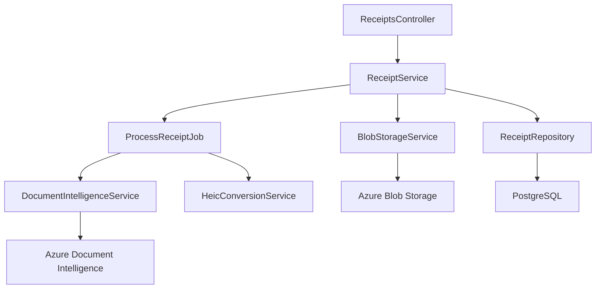

# Implementation Plan: Receipt Upload Pipeline

**Branch**: `003-receipt-pipeline` | **Date**: 2025-12-05 | **Spec**: [spec.md](./spec.md)
**Input**: Feature specification from `/specs/003-receipt-pipeline/spec.md`

## Summary

Enable receipt upload (PDF, JPG, PNG, HEIC) with Azure Document Intelligence extraction, storing files in Azure Blob Storage with async processing via Hangfire. Users upload receipts which are queued for OCR extraction, with results including vendor, date, amount, and line items stored in PostgreSQL.

## Technical Context

**Language/Version**: .NET 8 with C# 12 + ASP.NET Core Web API
**Primary Dependencies**: Entity Framework Core 8, Npgsql, Hangfire, Azure.AI.DocumentIntelligence, Azure.Storage.Blobs, Magick.NET
**Storage**: PostgreSQL 15+ (Supabase self-hosted), Azure Blob Storage (ccproctemp2025)
**Testing**: xUnit, Moq, FluentAssertions, TestContainers
**Target Platform**: AKS (dev-aks) with Web App Routing (NGINX)
**Project Type**: Web application (backend API + frontend React)
**Performance Goals**: 30-second extraction time (95th percentile), 100 concurrent uploads
**Constraints**: 25MB max file size, 1-month data retention, <$0.10/1000 receipts storage cost
**Scale/Scope**: 10-20 users, ~1000 receipts per user

## Constitution Check

*GATE: Must pass before Phase 0 research. Re-check after Phase 1 design.*

| Principle | Status | Evidence |
|-----------|--------|----------|
| I. Cost-First AI Architecture | PASS | Document Intelligence is pay-per-use (~$1.50/1000 pages). No tiered AI caching needed for OCR - it's a single-call extraction. |
| II. Self-Improving System | PASS | Extracted vendor names will feed VendorAliases in Sprint 5 matching. No learning loop needed in Sprint 3 (extraction only). |
| III. Receipt Accountability | PASS | This sprint IMPLEMENTS the core receipt upload requirement. All receipts stored with full audit trail. |
| IV. Infrastructure Optimization | PASS | Using existing AKS, existing Blob Storage (ccproctemp2025), existing Hangfire (Sprint 2). No new infra costs. |
| V. Cache-First Design | N/A | Document Intelligence extraction is not cacheable - each receipt is unique. Tier 1-4 caching applies to categorization (Sprint 6). |

**Constitution Compliance**: All applicable principles satisfied. No violations requiring justification.

## Project Structure

### Documentation (this feature)

```text
specs/003-receipt-pipeline/
├── plan.md              # This file
├── research.md          # Phase 0 output
├── data-model.md        # Phase 1 output
├── quickstart.md        # Phase 1 output
├── contracts/           # Phase 1 output (OpenAPI spec)
└── tasks.md             # Phase 2 output (/speckit.tasks command)
```

### Source Code (repository root)

```text
backend/
├── src/
│   ├── ExpenseFlow.Api/
│   │   ├── Controllers/
│   │   │   └── ReceiptsController.cs      # Receipt upload/list/detail endpoints
│   │   └── DTOs/
│   │       └── Receipts/                  # Request/Response DTOs
│   ├── ExpenseFlow.Core/
│   │   ├── Entities/
│   │   │   └── Receipt.cs                 # Receipt entity
│   │   ├── Interfaces/
│   │   │   ├── IReceiptRepository.cs
│   │   │   └── IDocumentIntelligenceService.cs
│   │   └── Services/
│   │       └── ReceiptService.cs          # Business logic
│   ├── ExpenseFlow.Infrastructure/
│   │   ├── Data/
│   │   │   └── Migrations/                # EF Core migrations for Receipt table
│   │   ├── Jobs/
│   │   │   └── ProcessReceiptJob.cs       # Hangfire job for async extraction
│   │   ├── Services/
│   │   │   ├── BlobStorageService.cs      # Azure Blob operations
│   │   │   ├── DocumentIntelligenceService.cs  # Azure Document Intelligence extraction
│   │   │   └── HeicConversionService.cs   # Magick.NET HEIC->JPG
│   │   └── Repositories/
│   │       └── ReceiptRepository.cs
│   └── ExpenseFlow.Shared/
│       └── Enums/
│           └── ReceiptStatus.cs           # Processing status enum
└── tests/
    ├── ExpenseFlow.Api.Tests/
    │   └── Controllers/
    │       └── ReceiptsControllerTests.cs
    ├── ExpenseFlow.Core.Tests/
    │   └── Services/
    │       └── ReceiptServiceTests.cs
    └── ExpenseFlow.Infrastructure.Tests/
        └── Services/
            └── DocumentIntelligenceServiceTests.cs

frontend/
├── src/
│   ├── components/
│   │   └── receipts/
│   │       ├── ReceiptUploader.tsx        # Drag-drop upload component
│   │       ├── ReceiptList.tsx            # Receipt list with thumbnails
│   │       └── ReceiptDetail.tsx          # Full receipt view
│   ├── pages/
│   │   └── Receipts.tsx                   # Receipts page
│   └── services/
│       └── receiptApi.ts                  # API client for receipts
└── tests/
    └── components/
        └── receipts/
            └── ReceiptUploader.test.tsx
```

**Structure Decision**: Extends existing Clean Architecture from Sprint 2. Receipt functionality added to existing projects following established patterns.

## Complexity Tracking

No constitution violations to justify. Implementation follows established patterns from Sprint 2.

## Dependencies Map



## Risk Assessment

| Risk | Impact | Mitigation |
|------|--------|------------|
| Document Intelligence service unavailable | HIGH | Fail immediately per clarification; user re-uploads when available |
| Large batch uploads causing timeouts | MEDIUM | Client-side chunking; async processing via Hangfire |
| HEIC conversion failures | LOW | SkiaSharp is mature; fallback to error status with clear message |
| Malware in uploaded files | HIGH | Microsoft Defender for Storage handles scanning automatically |
